    

    <ul>
        <li>🎓 I'm studying <b>Software Engineering</b> at the Crimean Federal University</li>
        <li>🌱 I'm currently learning <b>Asp.Net Core, TypeScript, React.</b></li>
        <li>🎯 I'm Working on Improving Mentoring &amp; Problem Solving skills.</li>
        <li>
            👨‍💻 My projects are available at&nbsp;
            
        </li>
        <li>
            📫 How to reach me: Send message to&nbsp;
            
            &nbsp;or&nbsp;
            
        </li>
        <li>🌐 I speak <ul><li>🇷🇺 &ndash; Native</li><li>🇬🇧 &ndash; Pre-Intermediate / Free reading of technical resources</li><li>🇺🇦 &ndash; Reading / Listening</li></ul></li>
        <li>💬 Ask me about:
            <dl>
                <dt>Technologies:</dt>
                    <dd>C#, .NET, WinAPI, Regular Expressions.</dd>
                <dt>Hobbies:</dt>
                    <dd>Computer Games, Music</dd>
            </dl>
        </li>
        <li>‍💻 Known technologies:
            <ul>
                <li>✅C#, ✅.NET Core, .NET Entity Framework Core, 🎓<i>ASP.NET Core</i>, Windows Forms, .NET Ecosystem</li>
                <li>SQL, MS SQL Server</li>
                <li>HTML, CSS, JavaScript, 🎓<i>TypeScript</i>, 🎓<i>React</i></li>
                <li>Git, ✅Regular Expressions, ✅Windows API, JSON, XML, T4 Template</li>
                <li>Windows &amp; Linux administration skills</li>
                <li>Python, C</li>
            </ul>
        </li>
    </ul>

    

